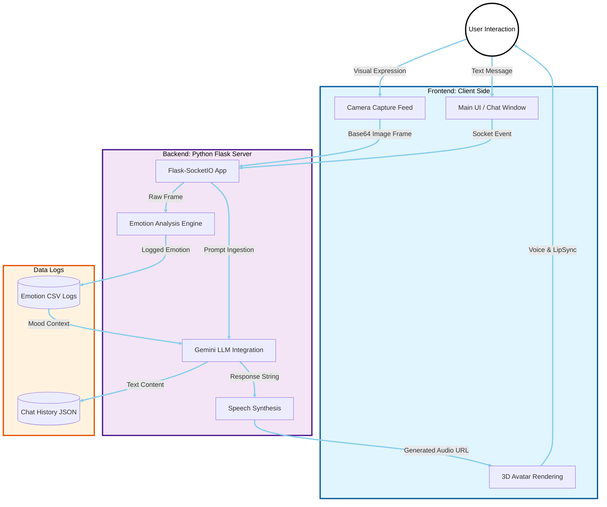
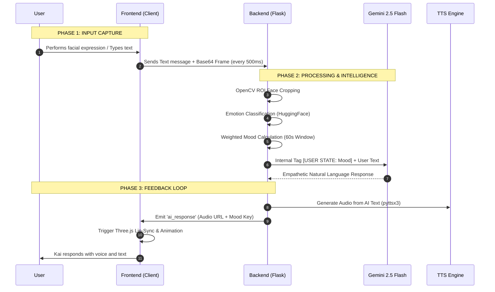

# Kai The Companion: An Emotionally Intelligent 3D AI Video Companion

**Kai The Companion** is a sophisticated, therapy-inspired AI companion designed to provide real-time, empathetic interaction through video and text. By leveraging computer vision and natural language processing, Kai detects user emotions via facial expressions and adapts its conversational tone to offer a personalized wellness experience.

## 🚀 Key Features

* **Real-time Emotion Detection:** Uses computer vision models to analyze facial expressions and map them to emotions such as Happy, Sad, Angry, and Fear.
* **Dynamic 3D Avatar:** Features a high-fidelity 3D avatar with lip-syncing and mood-based animations.
* **Adaptive Conversational AI:** Powered by Google's Gemini models, Kai receives emotional context tags to adjust its tone.
* **Smart Browser Commands:** Capability to search Google or play YouTube videos via voice/text commands.

---

## 🏗️ Project Architectures

### **1. System Architecture**

This diagram uses high-contrast styling with **thick black connectors** to ensure full visibility of the client-to-backend pipeline.



### **2. Detailed Data Flow (DFD)**

The sequence below features participating blocks and participant backgrounds to prevent any white-out effects on text or arrows.



---

## 📊 Technical Stack Breakdown

| Category | Technology Used |
| --- | --- |
| **Backend** | Python, Flask, Flask-SocketIO |
| **Frontend** | HTML5, CSS3, JavaScript (ES6), Three.js |
| **AI (Language)** | Google Generative AI (Gemini 2.5 Flash) |
| **Computer Vision** | OpenCV, HuggingFace Transformers |
| **Speech** | pyttsx3 (Text-to-Speech) |
| **Avatar Rendering** | TalkingHead library |

---

## ⚙️ Installation & Setup

1. **Clone the Repository:**
```bash
git clone https://github.com/rutujakumbhar17/kai-the-companion.git
cd Kai-The-Companion

```


2. **Install Dependencies:**
```bash
pip install -r requirements.txt

```


3. **Configure API Key:**
Create a `config.py` file in the root directory:
```python
apikey = "YOUR_GEMINI_API_KEY"

```


4. **Run the Server:**
```bash
python app.py

```


Access the application at `http://127.0.0.1:5000`.
